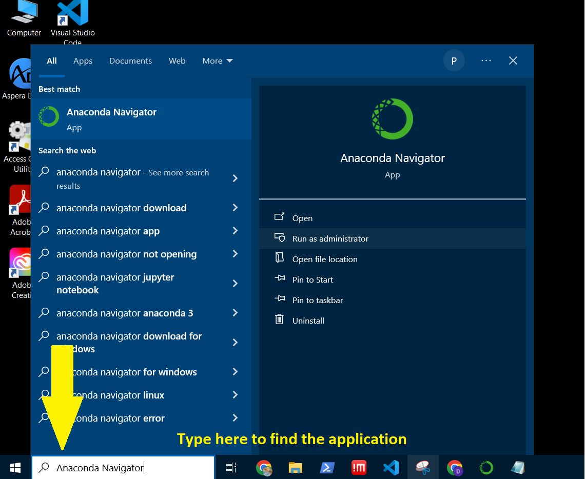
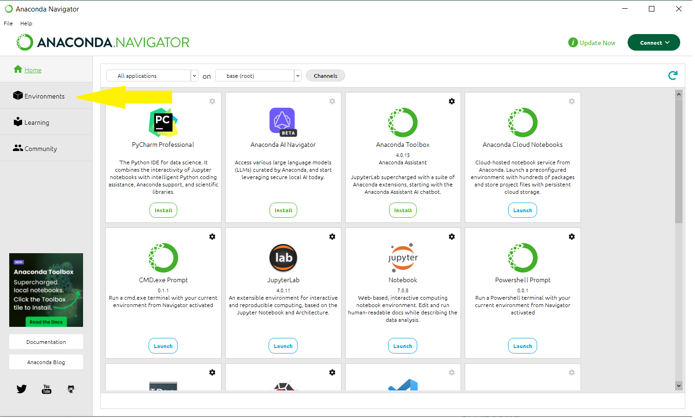
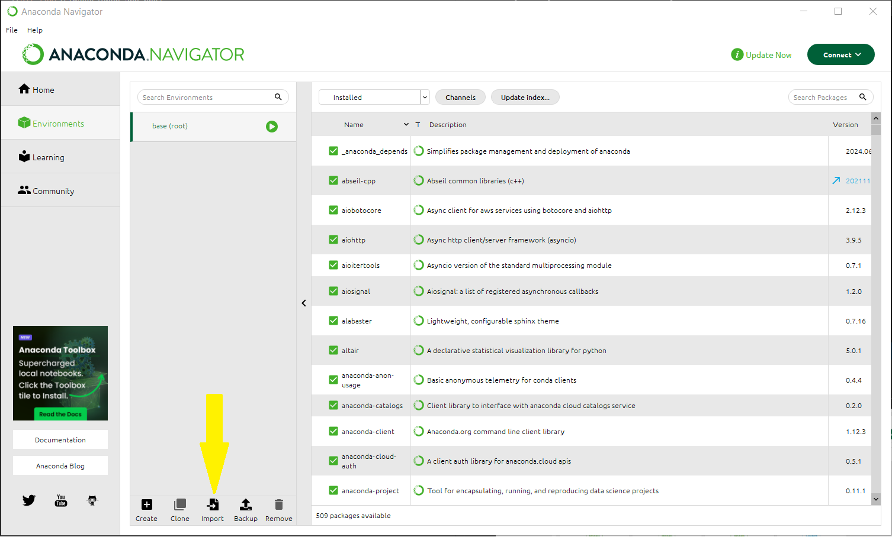
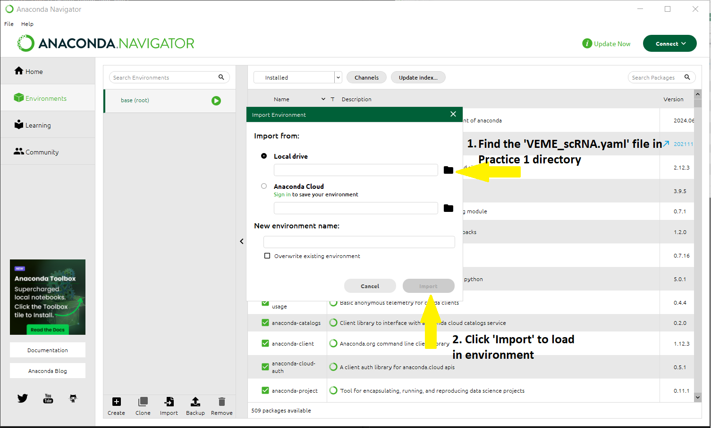
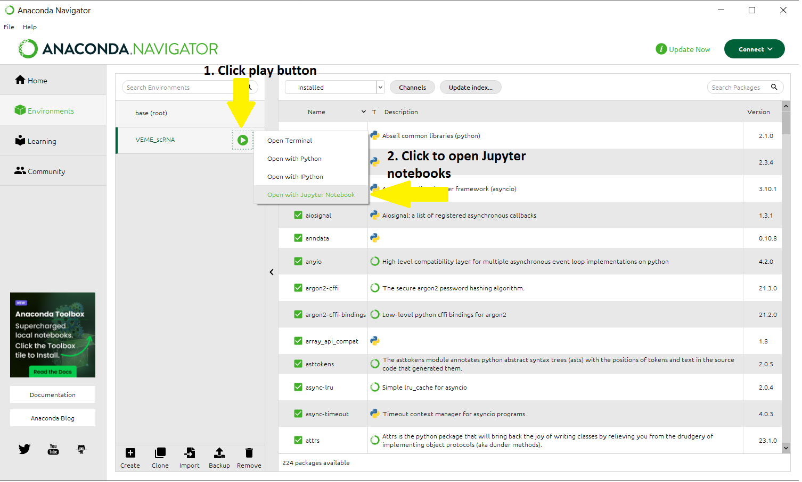

# Setting up the 'VEME_scRNA' environment

## Step 1: Open 'Anaconda Navigator'

## Step 2: Click the 'Environments' tab.

## Step 3: Click the 'Import' button 

## Step 4: Load in the 'VEME_scRNA.yaml' file 

## Step 5: Click the green play button near the 'VEME_scRNA' environment and click 'Open with Jupyter Notebook'

